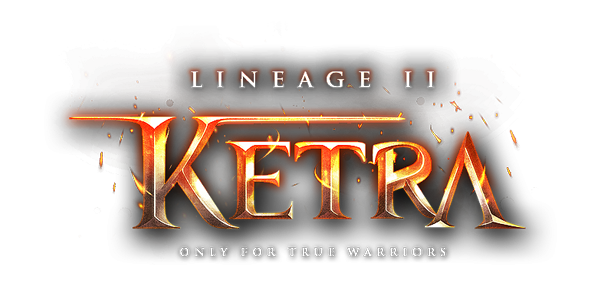

   

 

<h3 align=center>

💻 ***See the project online [here](https://l2-ketra.herokuapp.com/)***

</h3

   

 

 
 

## 📖 About
 
<h3>Lineage 2 Ketra Website</h3>

This website is a clone of the page [Lineage 2 Ketra](https://l2ketra.com/), made with the aim of studying the PHP language. 
In this project, the original page design was cloned, and the site scripts were developed by myself. 
Credits for original design [Atualstudio](https://atual.studio/)

## 🚀 Technologies 

- [PHP](https://www.php.net/)
- [SASS](https://sass-lang.com/)
- [JavaScript](https://www.javascript.com/)
- [MySQL](https://www.mysql.com/)
- [XAMPP](https://www.apachefriends.org/pt_br/index.html)

## ✨ Features
- Register system 
- Login system with SESSION for access the restrict pages change password and email 
-  

## 🤔 How to use

- Clone this repo: `git clone https://github.com/michaelsribeiro/L2Ketra.git`

- Install the project in the htdocs folder: `C:/xampp/htdocs/L2Ketra`

- `Turn on xampp server`

- Open your browser in: `http://localhost/L2Ketra/`

## 📝 Licence 

- This repo is under MIT Licence. You can see that <a href="https://github.com/michaelsribeiro/L2Ketra/blob/main/LICENSE.md"> LICENSE </a> for more details. 😉
